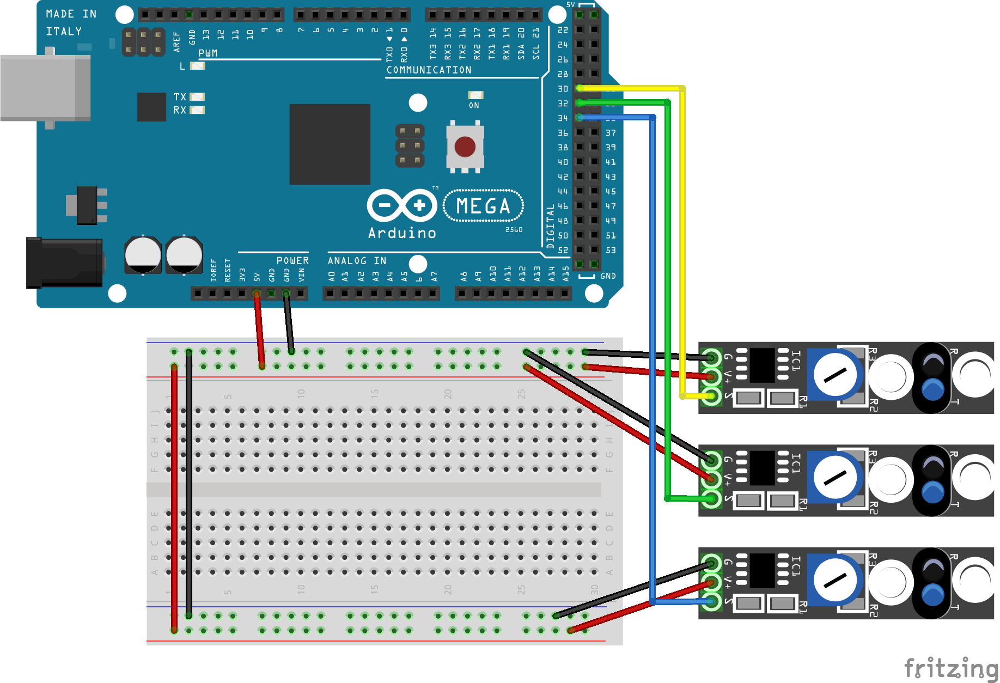

# Using 2 KY-033 sensors for Line Detection

This sketch is used to play around with line detection using three KY-033 sensors. The sensors are attached to a line-follower car with approximately 1.5cm between the sensor's center points. 

For the purpose of this example, the sensors were wired to an Arduino Mega as follows:
