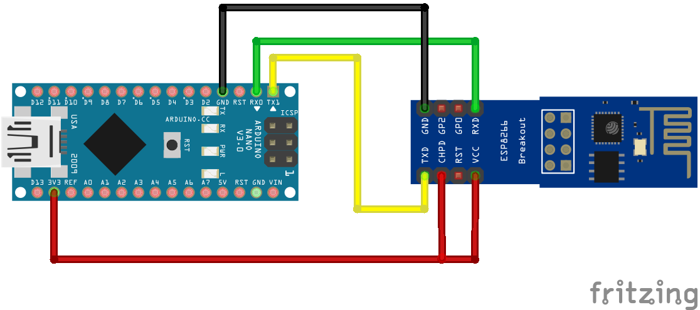
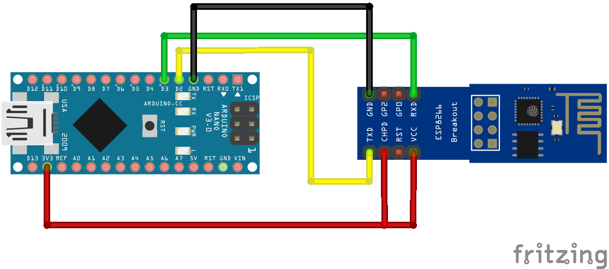

# ESP8266-01S as WiFi-Shield for Arduino

Used material: 
* Arduino Nano Board
* AZDelivery ESP8266-01S
* AZDelivery Breakout-Board / Breadboardadapter for ESP8266-01S [for convenience]

Web Resources:
* https://home.et.utwente.nl/slootenvanf/2018/03/17/connect-esp8266-control-blynk/
* https://www.heise.de/developer/artikel/Make-your-own-ESP8266-WiFi-Shield-3246107.html

| :warning:  The ESP8266-01S is operating on 3.3V! Do not connect to a 5V source - it'll burn the chip! :fire: |
| --- |

## 1st Step: Configure the ESP as a WiFi Client

Wire the ESP8266-01S according to the following chart:

Upload an empty sketch to the Arduino.

Use the Serial Monitor to configure the ESP:
* Default Baudrate of ESP (by manufacturer): 115200 -> Configure Serial Monitor accordingly, and set to "Both NL & CR"
* Send test command `AT` via Serial Monitor: should return `OK`
* Additional test command: `AT+GMR` returns chip info
* Reset the chip: `AT+RST`
* Set the Baudrate to 9600: `AT+UART_DEF=9600,8,1,0,0` (and change the speed of the Serial Monitor)
* Set-up the chip as WiFi client: `AT+CWMODE=1`
* [Optional] turn off command echo: `ATE0` (revert with `ATE1`)

## 2nd Step: Connect the ESP to a WiFi Network

Wire the ESP8266-01S according to the following chart:

* Use the WiFi_ESP8266-01S_connect.ino sketch.
* Put in the ssid and password of the WiFi you want to connect to.
* Upload the sketch and monitor its result via the Serial Monitor.
